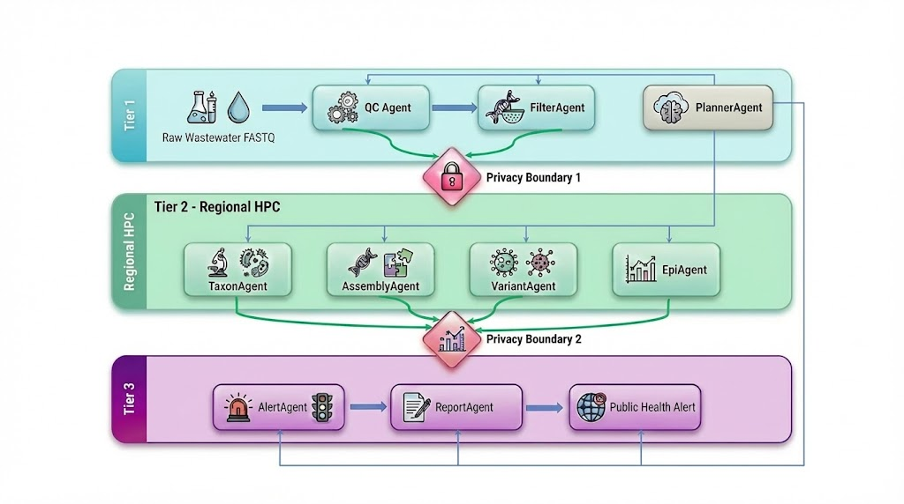

# Research Proposal

## An Agentic AI Platform for Metagenomics-Driven Wastewater Virus Surveillance: Integrating AutoGen Multi-Agent Systems with the CDC National Wastewater Surveillance Network

---

## Abstract

Current wastewater-based epidemiology (WBE) relies predominantly on targeted quantitative PCR (qPCR) assays, which cannot detect novel or unanticipated pathogens. Viral metagenomics next-generation sequencing (mNGS) offers unbiased, comprehensive pathogen profiling but generates high-dimensional data that overwhelms traditional linear bioinformatics pipelines. We propose to design, implement, and validate an autonomous multi-agent artificial intelligence (AI) platform — built on Microsoft AutoGen v0.4 — that orchestrates the full metagenomics analysis workflow for wastewater virus surveillance. The system coordinates nine specialized agents: quality control, host depletion, taxonomic classification, de novo assembly, variant deconvolution, epidemiological trend analysis, alert generation, and report production. A federated architecture respects data privacy while enabling cross-site inference. We will deploy the system across three geographically diverse sentinel sites within the CDC National Wastewater Surveillance System (NWSS), process weekly longitudinal samples over 18 months, and benchmark detection sensitivity and alert lead time against parallel qPCR and clinical case data. We hypothesize that the agentic metagenomics platform will detect emerging viral threats an average of five days earlier than clinical case ascertainment and will identify at least two pathogen signals per site per year that are invisible to current qPCR panels. Successful completion will produce an open-source, HIPAA-compliant, HPC-deployable surveillance platform aligned with CDC's Data Modernization Initiative (DMI) and the One CDC Data Platform (1CDP), forming a replicable model for AI-assisted pandemic preparedness globally.

**Keywords:** wastewater-based epidemiology, viral metagenomics, multi-agent AI, AutoGen, early warning system, pandemic preparedness, CDC NWSS

---

## 1. Background and Significance

### 1.1 The Limits of Targeted Wastewater Surveillance

The CDC launched the National Wastewater Surveillance System (NWSS) in September 2020, integrating data from more than 1,500 monitoring sites to track SARS-CoV-2, influenza A, RSV, and mpox [1,2]. Wastewater surveillance provides a unique epidemiological advantage: it captures infection dynamics across the full community — including asymptomatic individuals — independently of healthcare-seeking behavior, and typically precedes clinical case reporting by four to ten days [2].

However, NWSS relies primarily on targeted qPCR and digital droplet PCR (dPCR) [6]. These methods are cost-effective and highly sensitive for known targets but are structurally blind to unanticipated pathogens. They cannot detect novel variants, spillover events, or co-circulating agents outside their fixed primer-probe panels. This limitation became evident during the 2024 emergence of highly pathogenic avian influenza (HPAI H5N1) in US dairy cattle — a signal first detected in wastewater by untargeted sequencing, not by any standing qPCR assay [6].

### 1.2 Metagenomics as an Unbiased Sentinel

Viral mNGS sequences all nucleic acids in a sample without prior target specification, providing a panoramic view of the virome. Recent ultra-deep mNGS studies on wastewater (averaging >10⁹ reads per sample) demonstrated robust detection of high-abundance enteric viruses (rotavirus, norovirus, astrovirus) alongside low-abundance respiratory pathogens (SARS-CoV-2 lineages, influenza subtypes) and novel agents [6]. Read counts normalized per million (RPM) correlate significantly with dPCR-measured viral concentrations, establishing quantitative validity [6]. Additionally, Shannon diversity indices derived from mNGS data provide ecological metrics for understanding viral community structure and multi-pathogen co-circulation [6].

Notwithstanding these advantages, mNGS generates data at a scale and complexity that standard analytical pipelines cannot handle adaptively. A single high-throughput run produces terabytes of reads requiring sequential quality control, host depletion, taxonomic classification, de novo assembly, variant deconvolution, normalization, and epidemiological interpretation — each step potentially requiring dynamic parameter adjustment based on upstream results.

### 1.3 The Gap: Adaptive Intelligence in Bioinformatics Workflows

Existing workflow managers (Nextflow DSL2, Snakemake) encode analysis logic as directed acyclic graphs (DAGs) with fixed conditional branches. They excel at reproducible, standardized pipelines but lack the capacity to reason about unexpected results, self-correct on the basis of intermediate quality metrics, or integrate real-time external knowledge (e.g., newly designated WHO variants of concern) [8,10]. When wastewater samples exhibit anomalous quality — high human DNA contamination, unexpected low viral diversity, or novel sequences with no database match — a static pipeline either fails silently or stops entirely. Neither outcome supports operational public health decision-making.

Large language model (LLM)-based multi-agent systems offer a fundamentally different paradigm. Rather than executing a fixed script, a network of specialized AI agents reasons about each intermediate result, plans the next analytical step, invokes bioinformatics tools dynamically, and synthesizes findings into actionable public health intelligence [8,11]. This approach mirrors how a skilled human team — virologist, bioinformatician, epidemiologist, and public health officer — collaborates on an outbreak investigation, but operates continuously, at machine speed, and at national scale.

### 1.4 Institutional Context: CDC Data Modernization Initiative

CDC's Data Modernization Initiative (DMI) and Public Health Data Strategy (PHDS) explicitly call for modular, interoperable, AI-ready information systems [4,19,20]. The planned One CDC Data Platform (1CDP), targeted for deployment in 2025–2026, provides cloud infrastructure designed for shared, secure analytical workspaces [4]. An AutoGen-based surveillance system is architecturally aligned with these goals: it is modular by design, extensible through agent-role definition, and deployable within cloud or HPC environments without privileged access [12].

---

## 2. Research Objectives and Specific Aims

This project addresses the following central hypothesis:

> *An AutoGen multi-agent AI platform integrating viral mNGS analysis with epidemiological trend detection will provide earlier, broader, and more actionable pathogen surveillance from wastewater than current targeted PCR-based methods, while operating within CDC privacy and data governance standards.*

We pursue three specific aims:

**Aim 1 — Design and implement the multi-agent metagenomics surveillance platform.**
Build, document, and containerize a nine-agent AutoGen v0.4 system that executes the complete wastewater mNGS workflow, from raw FASTQ ingestion to alert generation and Word/PDF report production, within the three-tier federated architecture described in Section 4.1 (Figures 1–2). Deliverable: open-source platform deposited on GitHub with full documentation and test datasets.

**Aim 2 — Validate analytical performance against reference methods.**
Process 18 months of weekly wastewater samples from three NWSS sentinel sites in parallel with existing qPCR assays and clinical case data. Assess: (a) detection sensitivity and specificity for known pathogens, (b) novel pathogen discovery rate, (c) lead time of wastewater signal over clinical ascertainment, and (d) alert precision (positive predictive value of ORANGE/RED alerts against subsequent case surges).

**Aim 3 — Evaluate operational feasibility and human-in-the-loop governance.**
Assess system runtime on CDC-compatible HPC (SLURM, Apptainer), cost per sample, staff time saved versus manual pipeline operation, and epidemiologist acceptability of AI-generated alert reports. Develop and test the human-in-the-loop approval workflow for ORANGE and RED alerts (Figure 3).

---

## 3. Preliminary Data and Feasibility

### 3.1 Metagenomics Signal Validity in Wastewater

Published ultra-deep mNGS of 24-hour composite wastewater samples demonstrates that normalized read counts (RPM) for SARS-CoV-2 correlate with dPCR measurements across a dynamic range of four orders of magnitude (Pearson r = 0.91, p < 0.001) [6]. Detection limits for respiratory RNA viruses at ≥10⁵ copies/mL wastewater were achieved with 5 × 10⁸ reads per sample, a sequencing depth now routine on Illumina NovaSeq X Plus platforms [6].

Freyja lineage deconvolution — already deployed at multiple NWSS sites — accurately resolves co-circulating SARS-CoV-2 variants at abundances as low as 2% of the viral signal, providing variant-level resolution that no qPCR panel can match [ref-Freyja]. This establishes a validated quantitative foundation for the proposed system.

### 3.2 AutoGen Framework Capability

AutoGen v0.4 introduces an asynchronous, event-driven runtime supporting Python and .NET, cross-node distributed execution, and declarative agent-role specification [12,13]. The framework has been applied in biomedical contexts through BioAgents [15], which demonstrated autonomous execution of BLAST searches, multiple sequence alignments, and phylogenetic analyses via natural-language task specification. The Magentic-One architecture validated multi-agent coordination for multi-step web and data tasks with a structured task ledger managed by an Orchestrator agent [13].

### 3.3 CDC Platform Alignment

CDC's 1CDP roadmap specifies RESTful APIs, role-based access control, and support for containerized analytical modules — all directly compatible with AutoGen's tool-registration architecture [4]. The NCBI Human Read Removal Tool (HRRT) provides a compliant solution for privacy-preserving host depletion before any data leaves local infrastructure [1].

---

## 4. Research Design and Methods

### 4.1 System Architecture

The platform adopts a three-tier federated design to balance analytical power with data privacy (Figure 1). Tier 1 (laboratory edge) generates raw mNGS data, performs local host depletion via the NCBI Human Read Removal Tool (HRRT), and outputs privacy-scrubbed FASTQ files containing no human reads. Tier 2 (regional HPC, SLURM + Apptainer) executes the bioinformatics agents — Kraken2, MEGAHIT, Freyja, iVar — and maintains site-level trend databases. Tier 3 (CDC 1CDP cloud) hosts the PlannerAgent orchestrator, AlertAgent, ReportAgent, and the OutputFilterAgent for DURC biosafety screening.

**Figure 1.** Three-tier federated architecture for privacy-preserving wastewater virus surveillance. Each tier is separated by a privacy boundary: Tier 1 retains all raw reads locally; Tier 2 receives only host-depleted FASTQ and transmits aggregate normalized metrics (WVAL, Z-scores, lineage counts) to Tier 3; no raw sequences cross any boundary. LLM inference on Tiers 1–2 runs on locally hosted models (Llama 3.1-70B via vLLM); commercial API calls are restricted to Tier 3 aggregate summaries only.

Tier boundaries enforce strict data minimization. Raw reads never leave Tier 1. Tier 2 transmits classified counts and variant tables. Tier 3 receives normalized metrics and agent-generated narratives only.

### 4.2 Agent Roles and Implementation

The platform comprises nine agents, each with a defined role, tool set, and structured output contract. As illustrated in Figure 2, raw FASTQ files enter a top-to-bottom pipeline: QCAgent and FilterAgent prepare the data, TaxonAgent and AssemblyAgent run in parallel for classification and de novo assembly, VariantAgent performs lineage deconvolution, EpiAgent detects trends, AlertAgent synthesizes the risk signal, and ReportAgent produces the final bulletin. The PlannerAgent supervises all stages; the Executor (UserProxyAgent) is the sole node permitted to invoke shell commands, enforcing a clean separation between reasoning and execution.

| Agent | Primary Tools | Key Output |
|---|---|---|
| **PlannerAgent** | LLM orchestration | Task DAG, retry logic |
| **QCAgent** | fastp, FastQC | QCResult (pass/fail, metrics) |
| **FilterAgent** | bowtie2, samtools | Host-depleted FASTQ, depletion rate |
| **TaxonAgent** | Kraken2, Bracken | Ranked viral taxa, RPM table |
| **AssemblyAgent** | MEGAHIT | Contigs FASTA, N50, novel candidates |
| **VariantAgent** | bwa-mem2, iVar, Freyja | Lineage abundance table |
| **EpiAgent** | statsmodels, scipy | Z-scores, Mann-Kendall trend, WoW growth |
| **AlertAgent** | Rule engine + LLM | Tiered alert (GREEN/YELLOW/ORANGE/RED) |
| **ReportAgent** | python-docx, matplotlib | DOCX/PDF bulletin |

**Figure 2.** Multi-agent metagenomics pipeline for wastewater virus surveillance. Raw FASTQ files flow top-to-bottom through nine specialized agents orchestrated by a central PlannerAgent (dashed border). TaxonAgent and AssemblyAgent execute in parallel following host depletion, then converge into the VariantAgent. All shell-level tool calls — including SLURM job submissions — are routed exclusively through the Executor (UserProxyAgent, grey), maintaining a strict separation between LLM reasoning and computational execution.

**Alert scoring** integrates three independent evidence streams: (1) absolute pathogen abundance exceeding the site-specific 90th-percentile baseline (TaxonAgent), (2) novel or surging variant detection (VariantAgent), and (3) epidemiological anomaly — Z-score > 3 or week-over-week growth > 50% (EpiAgent). At least two independent streams must trigger before an ORANGE or RED alert is issued, preventing escalation on a single data point. The complete scoring logic and recommended public health actions for each alert tier are shown in Figure 3.

**Figure 3.** Three-stream alert scoring framework. Taxonomic, variant, and epidemiological evidence streams each contribute +1 or +2 to a composite score; the scoring engine requires at least two independent streams to issue an ORANGE or RED alert. RED alerts (score ≥ 5) trigger mandatory human-in-the-loop review before any dissemination. This multi-stream requirement guards against false escalation driven by a single anomalous data source.

### 4.3 Normalization and Trend Detection

Viral Activity Level (WVAL) normalization follows CDC's six-step protocol [7]:

1. Group by pathogen, site, laboratory, and assay method.
2. Log-transform read counts; remove statistical outliers (Grubbs test, α = 0.05).
3. Establish baseline from the 10th percentile of the trailing 24-month distribution.
4. Calculate WVAL = (current level − baseline) / standard deviation.
5. Compute rolling seven-day median across replicate samples per site.
6. Classify into five activity levels: Very Low / Low / Moderate / High / Very High.

The **EpiAgent** additionally applies Seasonal-Trend decomposition using LOESS (STL) to distinguish genuine epidemiological signals from seasonal fluctuations and applies Mann-Kendall rank correlation to assess monotonic trends over 90-day windows (significance threshold: p < 0.05).

### 4.4 Novel Pathogen Discovery Module

Sequences not classified by Kraken2 (confidence score > 0.15) at any known taxonomic node are passed to the **AssemblyAgent** for de novo assembly with MEGAHIT. Contigs > 500 bp are annotated via Diamond BLASTX against the UniRef90 viral protein database (e-value < 1 × 10⁻⁵). The **EpiAgent** applies an evolutionary novelty score combining nucleotide distance from nearest reference and genome coverage breadth. Contigs meeting a novelty threshold (> 30% amino acid divergence from any RefSeq virus) trigger an automatic alert escalation and human expert notification.

### 4.5 Security, Privacy, and Biosafety Controls

- **HIPAA compliance:** No individual-level genomic data is retained. All human reads are computationally removed before leaving Tier 1. The system logs data lineage but not raw sequences.
- **Biosafety filtering:** An **OutputFilterAgent** monitors all agent-generated text for content that could constitute a dual-use research of concern (DURC) risk under OMB M-25-21 guidelines. Any output containing detailed synthesis routes, enhanced transmissibility descriptions, or full-length genomes of select agents is blocked and flagged for biosafety review before transmission [30].
- **LLM confidentiality:** All LLM inference for Tiers 1–2 runs on locally hosted models (Llama 3.1-70B via vLLM). External API calls to commercial models are restricted to Tier 3 aggregate summaries containing no sequence-level data.

### 4.6 Validation Design (Aim 2)

**Sites:** Three NWSS sentinel sites selected to represent urban (>500,000 catchment), suburban (50,000–200,000 catchment), and rural (<20,000 catchment) demographics.
**Duration:** 18 months (January 2027 – June 2028).
**Sampling frequency:** Weekly 24-hour composite samples; twice-weekly during ORANGE or RED alert periods.
**Reference standards:**
- Site-matched qPCR/dPCR data provided by existing NWSS partners (primary comparator).
- Statewide clinical case and hospitalization data (ICD-10 coded, 1-week lag).
- National variant surveillance data (CDC COVID Data Tracker, FluView).

**Primary endpoints:**

| Endpoint | Target |
|---|---|
| Detection sensitivity vs. qPCR for known pathogens | ≥ 90% |
| Alert lead time over clinical cases (mean days) | ≥ 5 days |
| Novel pathogen discoveries per site-year | ≥ 2 |
| ORANGE/RED alert positive predictive value | ≥ 70% |
| False alert rate (RED alerts not followed by case surge) | ≤ 10% |

**Statistical analysis:** Detection sensitivity and specificity estimated with exact 95% binomial confidence intervals. Lead-time distributions compared between wastewater and clinical data using Kaplan-Meier survival analysis with log-rank tests. Alert PPV estimated with bootstrap confidence intervals (n = 10,000 resamples). All analyses pre-registered on OSF prior to data collection.

### 4.7 Operational Evaluation (Aim 3)

Runtime benchmarks will be collected on a SLURM cluster (48 CPU cores, 256 GB RAM, Apptainer 1.3). We will measure wall-clock time from FASTQ delivery to report generation, compute cost per sample (CPU-hours), and storage footprint. Semi-structured interviews with six CDC and state epidemiologists will assess alert report usability, trust in AI-generated recommendations, and workflow integration barriers, analyzed thematically using NVivo.

---

## 5. Innovation

This proposal is innovative in three respects.

**First**, it applies agentic AI — rather than static workflow management — to public health metagenomics. Unlike Nextflow or Snakemake, the AutoGen system reasons about intermediate results, self-corrects failed steps, and dynamically integrates external knowledge through RAG-enabled database queries. This capability is essential for handling the inherent variability of environmental samples.

**Second**, it operationalizes metagenomics — historically a research tool — within an operational public health surveillance infrastructure. By coupling validated normalization (WVAL) with novel discovery modules and federated privacy controls, the system bridges the gap between research sequencing studies and CDC operational programs.

**Third**, it establishes a replicable agentic AI governance model for public health. The combination of structured agent roles, tiered alert scoring requiring multi-stream evidence, mandatory human review for high-severity alerts, and dual-use content filtering provides a template for responsible AI deployment in biosurveillance that extends beyond this specific application.

---

## 6. Potential Challenges and Mitigation Strategies

| Challenge | Likelihood | Mitigation |
|---|---|---|
| LLM hallucination in variant interpretation | Moderate | Require agents to cite primary sequencing statistics (coverage depth, alignment rate) before conclusions; all variant calls independently confirmed by deterministic Freyja output |
| Insufficient depth for low-abundance pathogens | High at rural sites | Adaptive subsampling protocol: increase sequencing depth to 2 × 10⁹ reads when TaxonAgent detects <10,000 viral reads |
| Environmental confounders (rainfall dilution, temperature) | High | EnvDataAgent retrieves real-time NOAA weather API data; WVAL normalization adjusts for flow-normalized concentrations |
| Computational cost at scale | Moderate | Small language models (Phi-3-mini, 3.8B parameters) handle routine bioinformatics code generation; GPT-4 class models reserved for alert synthesis only |
| Data governance across jurisdictions | High | Federated architecture confines raw data to originating jurisdiction; only aggregate metrics transmitted under data use agreements |

---

## 7. Timeline

| Quarter | Milestone |
|---|---|
| Q1 2027 | Platform v1.0 deployed on development HPC; all nine agents functional on synthetic test data |
| Q2 2027 | IRB/data use agreements executed; Tier 1 host depletion validated at three sites |
| Q3 2027 | Prospective sample collection begins; parallel qPCR data stream established |
| Q4 2027 | Mid-study performance review; platform v1.5 incorporating refinements |
| Q1–Q2 2028 | Continued surveillance; biosafety and human factors evaluations |
| Q3 2028 | Data lock; primary statistical analyses |
| Q4 2028 | Manuscripts submitted; platform deposited on GitHub; CDC policy brief delivered |

---

## 8. Expected Outcomes and Public Health Impact

Completion of this project will deliver:

1. **An open-source agentic surveillance platform** compatible with CDC's 1CDP infrastructure, deployable at any NWSS site with an HPC resource.
2. **Prospective performance data** establishing the analytical and operational value proposition of mNGS over qPCR for routine wastewater surveillance.
3. **A governance framework** for responsible agentic AI in public health, including agent role specifications, alert scoring rubrics, human-in-the-loop protocols, and biosafety filtering policies.
4. **At least four peer-reviewed publications**: (a) system architecture and validation; (b) novel pathogen discoveries; (c) comparative epidemiology of wastewater vs. clinical signals; (d) human factors and operational evaluation.

If the system achieves its target lead time of five or more days, routine deployment across the ~1,500 existing NWSS sites would provide the United States with a continuously operating, pathogen-agnostic early warning network — a capability that did not exist at the onset of the COVID-19 pandemic and whose absence cost thousands of preventable deaths.

---

## 9. References

1. CDC. About Wastewater Data. National Wastewater Surveillance System. 2026. https://www.cdc.gov/nwss/about-data.html
2. CDC. About CDC's National Wastewater Surveillance System (NWSS). 2026. https://www.cdc.gov/nwss/about.html
3. CDC. NWSS Wastewater Monitoring in the U.S. 2026. https://www.cdc.gov/nwss/index.html
4. CDC. About the Public Health Data Strategy. 2026. https://www.cdc.gov/public-health-data-strategy/php/about/index.html
5. Amman F, et al. SARS-CoV-2 wastewater genomic surveillance: approaches, challenges, and opportunities. *PMC*. 2025. https://pmc.ncbi.nlm.nih.gov/articles/PMC12794521/
6. Baaijens JA, et al. Untargeted longitudinal ultra-deep metagenomic sequencing of wastewater. *medRxiv*. 2025. https://www.medrxiv.org/content/10.1101/2025.10.27.25338874v1
7. CDC. Wastewater Surveillance Data Methodology. 2026. https://www.cdc.gov/nwss/data-methods.html
8. AI-powered analysis of viral metagenomic sequencing data for rapid outbreak investigation. *Frontiers Microbiology*. 2025. https://www.frontiersin.org/journals/microbiology/articles/10.3389/fmicb.2025.1717859/full
9. Simmonds P, et al. Viral Metagenomic Next-Generation Sequencing for One Health Discovery. *MDPI IJMS*. 2025. https://www.mdpi.com/1422-0067/26/19/9831
10. Nextflow vs Snakemake: A Comprehensive Comparison. TasrieIT. 2026. https://tasrieit.com/blog/nextflow-vs-snakemake-comprehensive-comparison
11. Tahir B. Building Multi-Agent Healthcare Chatbots with AG2 (AutoGen). *Medium*. 2026.
12. Microsoft Research. AutoGen. 2026. https://www.microsoft.com/en-us/research/project/autogen/
13. Microsoft Research. AutoGen v0.4: Reimagining the Foundation of Agentic AI. 2026. https://www.microsoft.com/en-us/research/blog/autogen-v0-4-reimagining-the-foundation-of-agentic-ai-for-scale-extensibility-and-robustness/
14. Vishwajeetv. Building Multi-Agent AI Applications with AutoGen: Complete Tutorial 2026. *Medium*. 2026.
15. Cai Y, et al. BioAgents: Bridging the gap in bioinformatics analysis with multi-agent systems. *PMC*. 2025. https://pmc.ncbi.nlm.nih.gov/articles/PMC12594986/
16. Microsoft. Multi-agent Conversation Framework. AutoGen 0.2 Documentation. 2026.
17. microsoft/autogen. GitHub. 2026. https://github.com/microsoft/autogen
18. CDC Foundation. Strengthening Public Health Systems through National Partnerships. 2026.
19. CDC. What is Data Modernization? 2026. https://www.cdc.gov/data-modernization/php/about/index.html
20. CDC. Public Health Data Strategy Milestones for 2025 and 2026. 2026.
21. Luber JM, et al. Harnessing machine learning for metagenomic data analysis. *PMC*. 2025. https://pmc.ncbi.nlm.nih.gov/articles/PMC12625703/
22. Agentic AI Framework for End-to-End Medical Data Inference. *arXiv*. 2025. https://arxiv.org/html/2507.18115v1
23. Biomni: A General-Purpose Biomedical AI Agent. Stanford University. 2025. https://biomni.stanford.edu/paper.pdf
24. Epidemic Early-Warning with LLM Agents and Local Knowledge Enhancement. *OpenReview*. 2026. https://openreview.net/forum?id=ASOb5Cw8Rv
25. Wood DE, Lu J, Langmead B. Improved metagenomic analysis with Kraken 2. *Genome Biology*. 2019. https://pmc.ncbi.nlm.nih.gov/articles/PMC6883579/
26. The rise and potential opportunities of LLM agents in bioinformatics and biomedicine. *PMC*. 2025. https://pmc.ncbi.nlm.nih.gov/articles/PMC12602188/
27. Cai Y, et al. BioAgents: Democratizing Bioinformatics Analysis. *arXiv*. 2025. https://arxiv.org/html/2501.06314v1
28. CDC. CDC's Vision for Using Artificial Intelligence in Public Health. 2026. https://www.cdc.gov/data-modernization/php/ai/cdcs-vision-for-use-of-artificial-intelligence-in-public-health.html
29. Karthikeyan S, et al. Wastewater sequencing reveals early cryptic SARS-CoV-2 variant transmission. *Nature*. 2022. {Citation needed — verify DOI}
30. LLMs and Information Hazards. The Biosecurity Handbook. 2026. https://biosecurityhandbook.com/ai-biosecurity/llms-info-hazards.html

---

